# AKSHADA AI-Enhanced Engagement Tracker for Young Learners (Infosys Internship - October 2024)

## Image Processing

### Libraries or Frameworks Used:
- **OpenCV**: Version 4.10.0.84
- **NumPy**: Efficient array operations and computation.

### Developed Logics:

#### A) `image_concatenation`
This function resizes two images to a specified pixel range and combines them both horizontally and vertically. The results are displayed in separate windows.

- **Input:**

  &nbsp;&nbsp;&nbsp;&nbsp;
  

- **Output:**
  

  
  

#### B) `contour_detection`
This detects contours in a grayscale image using a binary threshold and `cv2.findContours()`. The contours are drawn onto the original image in green.

- **Input:**

  

- **Output:**

  

#### C) `crop`
This function extracts a specific region of an image based on pixel range and displays the cropped section.

- **Input:**
 
    

- **Output:**
 
  

#### D) `dil_ero`
This function applies morphological operations, dilation and erosion, to enhance and reduce features in an image, respectively.

- **Input:**
 
   

- **Output:**

  

#### E) `edge`
This applies the Canny edge detection algorithm to detect edges in a grayscale image.

- **Input:**
 
    

- **Output:**
 
  

#### F) `hist_eq`
This enhances the contrast of a grayscale image using histogram equalization.

- **Input:**

     

- **Output:**
 
  

#### G) `color_filtering`
This converts a color image from the BGR color space to HSV.

- **Input:**

     

- **Output:**
 
  

#### H) `morphological_transformation`
This applies opening and closing morphological operations to a grayscale image to remove noise and fill gaps.

- **Input:**

   

- **Output:**
 
  

#### I) `image_resize`
This resizes an image to specified dimensions.

- **Input:**
 
     

- **Output:**
 
  

#### J) `rgbtogrey`
This converts a color image to grayscale.

- **Input:**

     

- **Output:**
 
  

#### K) `rotate`
This rotates an image by 90 degrees around its center.

- **Input:**

     

- **Output:**

  

#### L) `blur_image`
This applies a Gaussian blur to an image to reduce noise and detail.

- **Input:**

  

- **Output:**
 
  

#### M) `template`
This function performs template matching to locate a template image within a larger image.

  &nbsp;&nbsp;&nbsp;&nbsp;
  

- **Output:**

## Video Processing

### Libraries or Frameworks Used:
- **OpenCV**: Version 4.10.0.84

### Developed Logics:

#### A) `read_video`
This function reads video.

- **Output:**
 

#### B) `fps`
This function captures video from the webcam, displays it in real-time, and calculates the FPS.

- **Output:**
  

      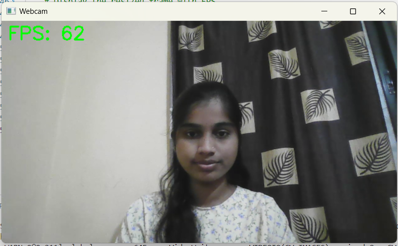
  

#### C) `Video_concatenation`
This function reads and resizes two video files, concatenating them horizontally.

- **Output:**
  

       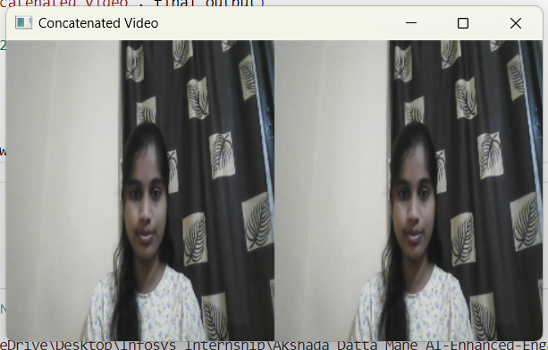
  

#### D) `read_save_video`
This function captures live video and saves it to a specified output file.

#### E) `capture_live_video`
This function captures live video from the webcam and displays it in real-time.

## Annotations

### Libraries or Frameworks Used:
- **OpenCV**: Version 4.10.0.84
- **LabelImg**: Version 1.8.6

### Developed Logics:

#### A) `label`
This function draws bounding boxes on images based on annotations in the label files.

- **Input:**

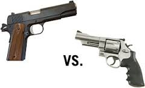

- **Output:**

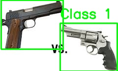

#### B) `data_segregate`
This function organizes images and their label files into matched and unmatched directories.

#### C) `label_manipulate`
This function updates class numbers in label files for object detection tasks.

## Face Recognition

### Libraries or Frameworks Used:
- **OpenCV**: Version 4.10.0.84
- **LabelImg**: Version 1.8.6
- **dlib**: Version 19.24.99
- **pandas**: Version 2.2.3
- **numpy** == 1.26.3
- **face_recognition**: Version 1.3.0
- **imutils**: Version 0.5.4
- 

### Developed Logics:

#### A) `Face_Recog`
This system analyzes live video frames for real-time face recognition, comparing them with known images. If a match is found, the person's name is displayed; if not, "Not that person" appears.

- **Input:**

- **Output:**
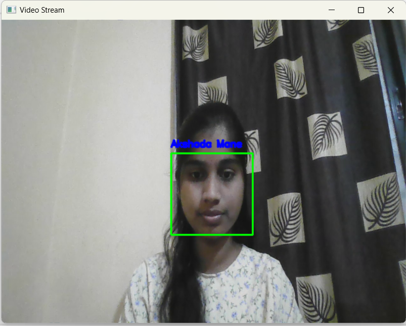

#### B) `attendence`
The attendance script captures live video frames using OpenCV, detects faces, and compares them with a known image using the face_recognition library. If a match is found, it logs the person's name, date, and time in a DataFrame, which is periodically saved to an Excel file after a set number of recognitions. The process continues until the user presses 'q' to exit the application.

- **Input:**

- **Output:**

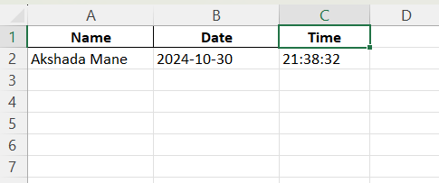

#### C) `test`
This performs real-time face recognition to identify He/She in a live video feed, logging each recognition event with the date and time into an Excel file every 30 seconds. It tracks recognition intervals to avoid duplicate entries and displays He/She or "Not He/She" based on identification.

- **Input:**

- **Output:**
- 

  attendance.xlsx
  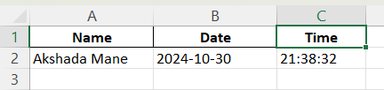

#### D) `excel_sc`
This is for face recognition with time-based logging looks well-structured and includes the logic to save screenshots and log attendance into an Excel file.

1. **Efficiency**: Resizing frames to 640x480 is good for speed. You can reduce the size further if needed.
2. **File Saving**: Screenshots are saved in `"Teja_screenshots(5)"`, and Excel is updated every 30 seconds.
3. **Recognition Timings**: Logs every 30 seconds for the same person and logs every 5 minutes to avoid multiple entries in short time frames.
4. **Error Handling**: Proper `try-except` block for handling errors.
5. **Termination**: Exits when the 'q' key is pressed.

- **Input:**

- **Output:**
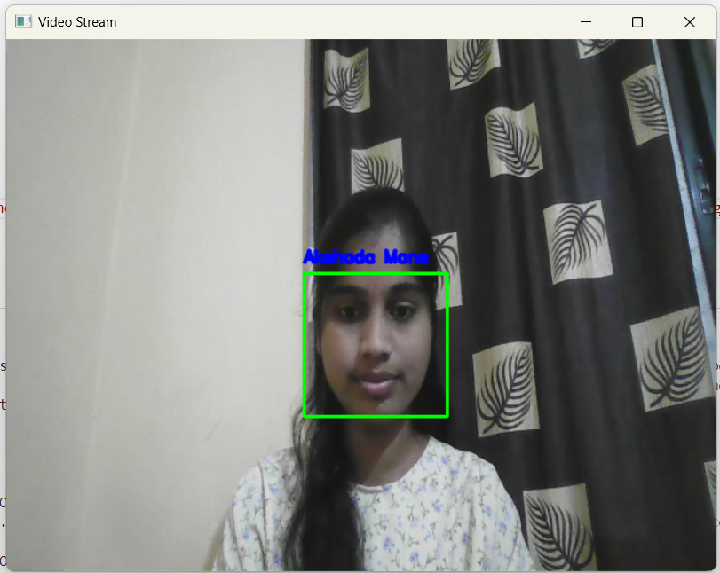

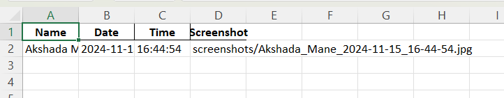

#### E) `excel_sc_dt`
This uses OpenCV and `face_recognition` to detect and recognize a specific face (His/Her's) from a webcam feed. Upon recognition, a screenshot is saved, and the attendance (name, date, time, screenshot path) is logged into an Excel file. The script processes every second frame, saves data every 30 seconds, and ensures attendance is only logged every 5 minutes for the same person. The attendance data is stored in a DataFrame and periodically exported to an Excel file.

Key Features:
- Real-time face detection and recognition
- Saves screenshots with timestamp
- Logs attendance to Excel every 30 seconds
- Avoids multiple logs within a 5-minute interval for the same person

- **Input:**

- **Output:**
- 

  

#### F) `landmark`
This code is a face recognition and attentiveness tracking system that operates in real time. Key functions include:

1. **Face Recognition**: Detects and recognizes "His/Her's face" from the camera using a pre-loaded image.
2. **Attentiveness Detection**: Uses facial landmarks and head pose estimation to assess if the subject is attentive.
3. **Logging**: Records each recognition event with a timestamp, attentiveness status, and screenshot in an Excel file, saving every 30 seconds.
4. **Live Feedback**: Displays "Attentive" or "Not Attentive" on the video feed along with facial landmarks.

The system continues until you press 'q' to exit.

- **Input:**

- **Output:**

  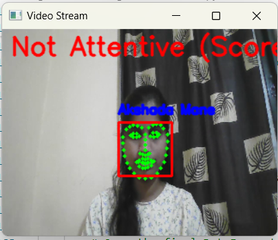
   
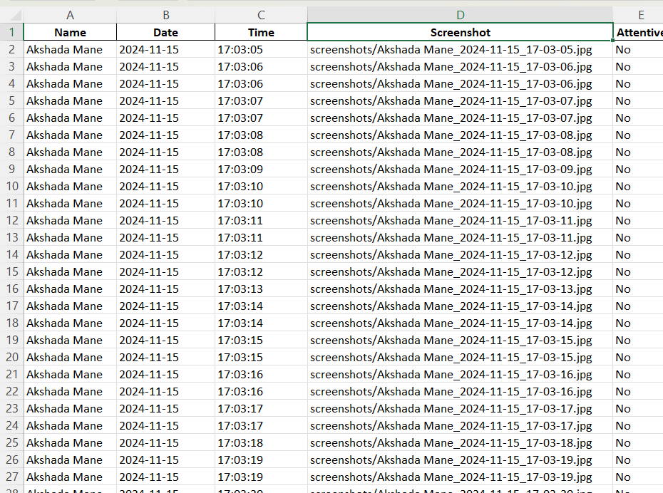

#### G) `atten_score`
This script captures real-time webcam video to recognize "His/Her's face" and assess attentiveness based on head pose:

1. **Setup**: Loads His/Her's face data and initializes detectors.
2. **Face Recognition**: Compares detected faces with the known face, identifying if it's a match.
3. **Attentiveness Check**: Estimates head orientation (yaw/pitch) to compute an attentiveness score.
4. **Logging**: Logs details (name, date, time, attentiveness, screenshot) in an Excel file every 30 seconds if attentive.
5. **Display**: Shows video with face labels, attentiveness status, and facial landmarks. 

Exits on 'q' press, ensuring the final save to Excel.

- **Input:**

- **Output:**
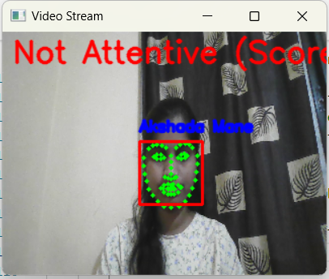

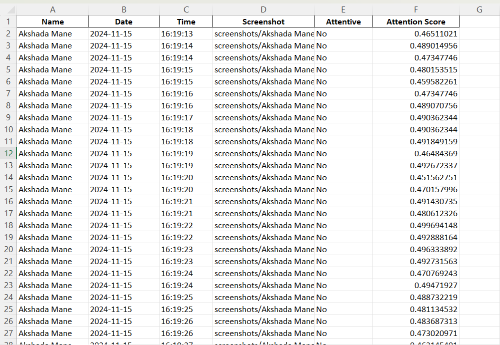

#### H) `avg_attendance_score`
This captures webcam video, performs face recognition for "His/Her's face," calculates attentiveness based on the head pose, and logs the data into an Excel file every 30 seconds. 
The final output includes an Excel file with logged details and an average attentiveness score at the end of the session. The user can stop the video stream by pressing 'q'.

- **Input:**

- **Output:**

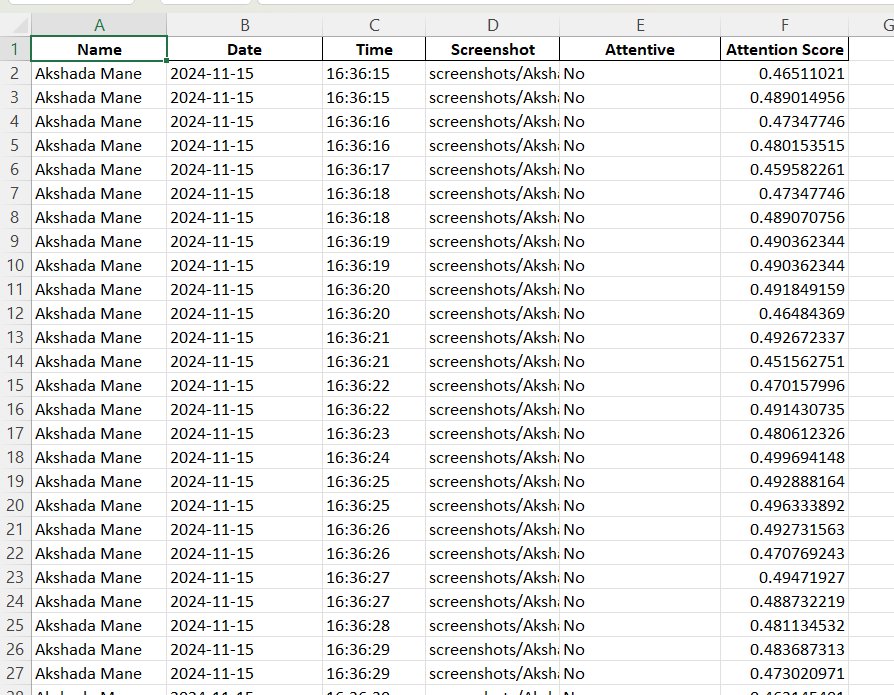

<h1>Final Project : AI-Enhanced-Engagement-Tracker-for-Young-Learners</h1>

  This project is designed to monitor and analyze user engagement using facial recognition and predictive analytics. The system leverages facial landmark detection and machine learning models to assess engagement levels in real-time.

<h2>Project Structure</h2>

<ul>
  <li>
    <strong>Folders:</strong>
    <ul>
      <li><code>engagement_reports/</code>: Contains the generated engagement analysis reports.</li>
      <li><code>known_faces/</code>: Stores images of known faces for recognition.</li>
      <li><code>templates/</code>: HTML templates for the web interface.</li>
    </ul>
  </li>
  <li>
    <strong>Key Files:</strong>
    <ul>
      <li><code>app.py</code>: Main Flask application to run the web interface and connect backend functionalities.</li>
      <li><code>data_processor.py</code>: Handles data preprocessing for the engagement model.</li>
      <li><code>download_predictor.py</code>: Script to download the required pre-trained predictor models.</li>
      <li><code>engagement_cnn_model.py</code>: Contains the deep learning model for engagement level prediction.</li>
      <li><code>engagement_monitor.py</code>: Core module to monitor and analyze engagement in real-time.</li>
      <li><code>facial_landmark_predictor_model.py</code>: Implements facial landmark detection for accurate feature extraction.</li>
      <li><code>register_faces.py</code>: Script to register and store known faces for recognition.</li>
      <li><code>run_engagement_monitor.py</code>: Standalone script to execute the engagement monitoring process.</li>
    </ul>
  </li>
</ul>

<h2>Features</h2>

<ul>
  <li><strong>Facial Recognition:</strong> Uses pre-trained models to identify individuals from known faces.</li>
  <li><strong>Engagement Prediction:</strong> Employs a convolutional neural network (CNN) to predict engagement levels based on facial landmarks.</li>
  <li><strong>Web Interface:</strong> Built with Flask, the interface provides interactive access to monitor engagement data.</li>
  <li><strong>Reports:</strong> Automatically generates engagement reports for analysis.</li>
  <li><strong>Customization:</strong> Users can register their own known faces for personalized monitoring.</li>
</ul>

<h2>Usage</h2>

<h3>Running the Web Application</h3>

Start the Flask app:

<pre><code>python app.py</code></pre>

Access the web interface at <a href="http://localhost:5000" target="_blank">http://localhost:5000</a>.

<h3>Registering Faces</h3>

To add a new face to the <code>known_faces</code> directory, use:

<pre><code>python register_faces.py --name &lt;name&gt; --image &lt;image_path&gt;</code></pre>

<h3>Monitoring Engagement</h3>

Run the standalone script to monitor engagement:

<pre><code>python run_engagement_monitor.py</code></pre>

<h2>Technologies Used</h2>

<ul>
  <li><strong>Python:</strong> Core language for backend development.</li>
  <li><strong>Flask:</strong> Web framework for the user interface.</li>
  <li><strong>OpenCV:</strong> For image and video processing.</li>
  <li><strong>Dlib:</strong> For facial landmark detection.</li>
  <li><strong>TensorFlow/Keras:</strong> For building the CNN model.</li>
  <li><strong>HTML/CSS:</strong> For web interface design.</li>
</ul>

<h2>Output Screenshots</h2>

<h3>Web Interface</h3>

<h3>Engagement Monitoring in Action</h3>

