# AKSHADA AI-Enhanced Engagement Tracker for Young Learners (Infosys Internship - October 2024)

## Image Processing

### Libraries or Frameworks Used:
- **OpenCV**: Version 4.10.0.84
- **NumPy**: For array manipulation

### Developed Logics:

#### A) `image_concatenation`
This function resizes two images to a specified pixel range and combines them both horizontally and vertically. The results are displayed in separate windows.

- **Input:**

  &nbsp;&nbsp;&nbsp;&nbsp;
  

- **Output:**

  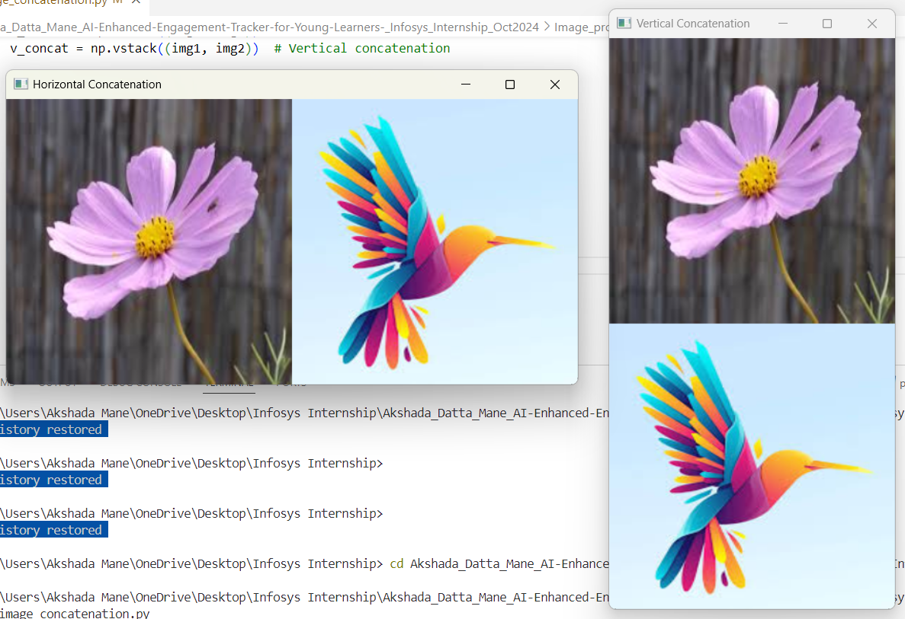

#### B) `contour_detection`
This detects contours in a grayscale image using a binary threshold and `cv2.findContours()`. The contours are drawn onto the original image in green.

- **Input:**

  

- **Output:**

  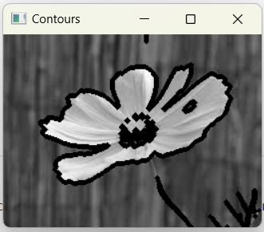

#### C) `crop`
This function extracts a specific region of an image based on pixel range and displays the cropped section.

- **Input:**
 
    

- **Output:**
 
  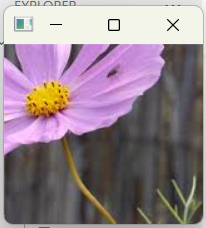

#### D) `dil_ero`
This function applies morphological operations, dilation and erosion, to enhance and reduce features in an image, respectively.

- **Input:**
 
   

- **Output:**

  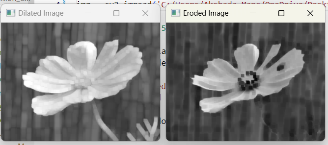

#### E) `edge`
This applies the Canny edge detection algorithm to detect edges in a grayscale image.

- **Input:**
 
    

- **Output:**
 
  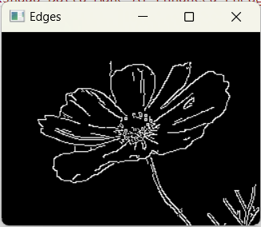

#### F) `hist_eq`
This enhances the contrast of a grayscale image using histogram equalization.

- **Input:**

     

- **Output:**
 
  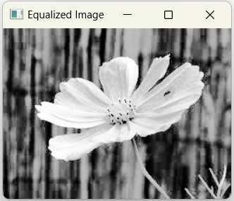

#### G) `color_filtering`
This converts a color image from the BGR color space to HSV.

- **Input:**

     

- **Output:**
 
  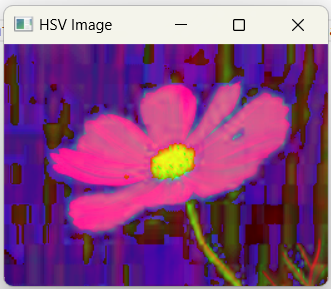

#### H) `morphological_transformation`
This applies opening and closing morphological operations to a grayscale image to remove noise and fill gaps.

- **Input:**

   

- **Output:**
 
  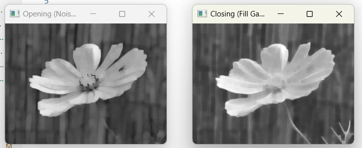

#### I) `image_resize`
This resizes an image to specified dimensions.

- **Input:**
 
     

- **Output:**
 
  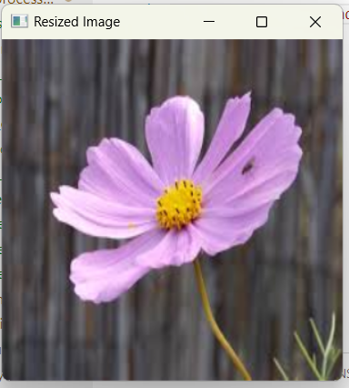

#### J) `rgbtogrey`
This converts a color image to grayscale.

- **Input:**

     

- **Output:**
 
  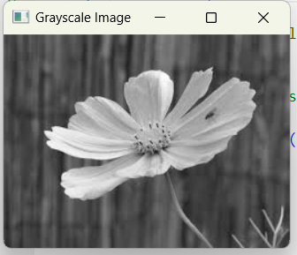

#### K) `rotate`
This rotates an image by 90 degrees around its center.

- **Input:**

     

- **Output:**

  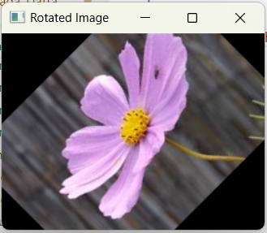

#### L) `blur_image`
This applies a Gaussian blur to an image to reduce noise and detail.

- **Input:**

  

- **Output:**
 
  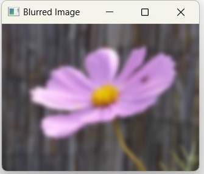

#### M) `template`
This function performs template matching to locate a template image within a larger image.

  &nbsp;&nbsp;&nbsp;&nbsp;
  

- **Output:**

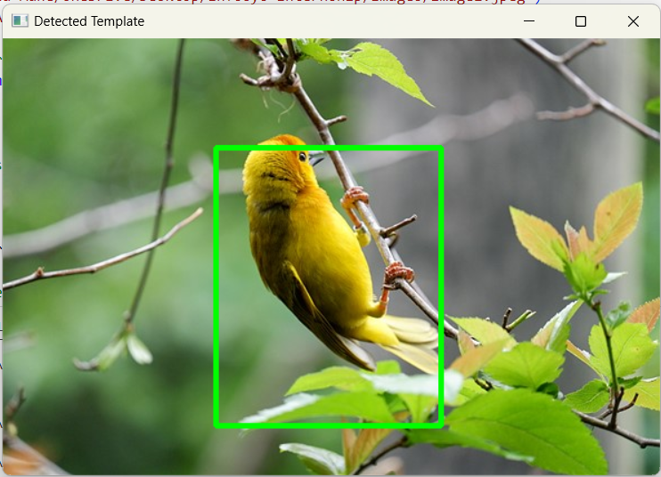

## Video Processing

### Libraries or Frameworks Used:
- **OpenCV**: Version 4.10.0.84

### Developed Logics:

#### A) `fps`
This function captures video from the webcam, displays it in real-time, and calculates the FPS.

- **Input:**

  

- **Output:**
 
  
  
#### B) `Video_concatenation`
This function reads and resizes two video files, concatenating them horizontally.

#### C) `read_video`
This function reads video.

#### D) `read_save_video`
This function captures live video and saves it to a specified output file.

#### E) `capture_live_video`
This function captures live video from the webcam and displays it in real-time.

## Annotations

### Libraries or Frameworks Used:
- **OpenCV**: Version 4.10.0.84
- **LabelImg**: Version 1.8.6

### Developed Logics:

#### A) `data_segregate`
This function organizes images and their label files into matched and unmatched directories.

- **Input:**

- **Output:**

#### B) `label`
This function draws bounding boxes on images based on annotations in the label files.

- **Input:**

- **Output:**

#### C) `label_manipulate`
This function updates class numbers in label files for object detection tasks.

- **Input:**

- **Output:**

## Face Recognition

### Libraries or Frameworks Used:
- **OpenCV**: Version 4.10.0.84
- **LabelImg**: Version 1.8.6
- **dlib**: Version 19.24.6
- **face_recognition**: Version 1.3.0
- **imutils**: Version 0.5.4

### Developed Logics:

#### A) `Face_recognition`
This performs real-time face recognition to identify whether the person in live video frames a known image by comparing. His name is displayed if He/She is recognized; otherwise, "Not He/She" appears.

- **Input:**

- **Output:**

#### B) `Attendence_save`
Using a live video stream, this performs real-time face recognition to identify He/She. When He/She's face is recognized, his/her name is displayed on the video feed, and the recognition event is logged with the date and time in an Excel file. After every 5 recognitions, the current log is saved to an Excel file, and the recognition counter and DataFrame are reset.

- **Input:**

- **Output:**

#### C) `test`
This performs real-time face recognition to identify He/She in a live video feed, logging each recognition event with the date and time into an Excel file every 30 seconds. It tracks recognition intervals to avoid duplicate entries and displays He/She or "Not He/She" based on identification.

- **Input:**

- **Output:**

#### D) `tools`
This performs real-time face recognition using the live camera feed to identify He/She. Each time a face is recognized, it records the name, date, and time in a data frame. Once a recognition count of 5 is reached, it saves the records to an Excel file, then resets the counter and DataFrame. It displays "He/She's name" or "Not He/She's name" over the video feed, and pressing 'q' exits the program with a final save of any remaining records.

- **Input:**

- **Output:**

#### E) `excel_sc`
This is for face recognition with time-based logging looks well-structured and includes the logic to save screenshots and log attendance into an Excel file.

1. **Efficiency**: Resizing frames to 640x480 is good for speed. You can reduce the size further if needed.
2. **File Saving**: Screenshots are saved in `"Teja_screenshots(5)"`, and Excel is updated every 30 seconds.
3. **Recognition Timings**: Logs every 30 seconds for the same person and logs every 5 minutes to avoid multiple entries in short time frames.
4. **Error Handling**: Proper `try-except` block for handling errors.
5. **Termination**: Exits when the 'q' key is pressed.

- **Input:**

- **Output:**

#### F) `excel_sc_dt`
This uses OpenCV and `face_recognition` to detect and recognize a specific face (His/Her's) from a webcam feed. Upon recognition, a screenshot is saved, and the attendance (name, date, time, screenshot path) is logged into an Excel file. The script processes every second frame, saves data every 30 seconds, and ensures attendance is only logged every 5 minutes for the same person. The attendance data is stored in a DataFrame and periodically exported to an Excel file.

Key Features:
- Real-time face detection and recognition
- Saves screenshots with timestamp
- Logs attendance to Excel every 30 seconds
- Avoids multiple logs within a 5-minute interval for the same person

- **Input:**

- **Output:**

#### G) `landmark`
This code is a face recognition and attentiveness tracking system that operates in real time. Key functions include:

1. **Face Recognition**: Detects and recognizes "His/Her's face" from the camera using a pre-loaded image.
2. **Attentiveness Detection**: Uses facial landmarks and head pose estimation to assess if the subject is attentive.
3. **Logging**: Records each recognition event with a timestamp, attentiveness status, and screenshot in an Excel file, saving every 30 seconds.
4. **Live Feedback**: Displays "Attentive" or "Not Attentive" on the video feed along with facial landmarks.

The system continues until you press 'q' to exit.

- **Input:**

- **Output:**

#### H) `atten_score`
This script captures real-time webcam video to recognize "His/Her's face" and assess attentiveness based on head pose:

1. **Setup**: Loads His/Her's face data and initializes detectors.
2. **Face Recognition**: Compares detected faces with the known face, identifying if it's a match.
3. **Attentiveness Check**: Estimates head orientation (yaw/pitch) to compute an attentiveness score.
4. **Logging**: Logs details (name, date, time, attentiveness, screenshot) in an Excel file every 30 seconds if attentive.
5. **Display**: Shows video with face labels, attentiveness status, and facial landmarks. 

Exits on 'q' press, ensuring the final save to Excel.

- **Input:**

- **Output:**

#### I) `avg_atten_score`
This captures webcam video, performs face recognition for "His/Her's face," calculates attentiveness based on the head pose, and logs the data into an Excel file every 30 seconds. Here is a summary of its key actions:

1. **Face Recognition**: Uses `face_recognition` to identify "His/Her's face" by comparing face encodings.
2. **Head Pose Detection**: Calculates the head pose (yaw, pitch) using `dlib`'s facial landmark predictor to assess attentiveness.
3. **Attentiveness Calculation**: Computes an attentiveness score based on yaw and pitch, with values between 0 (not attentive) and 1 (fully attentive).
4. **Logging**: Every 30 seconds, the script saves recognized face data (name, date, time, attentiveness, attention score, and screenshot) into an Excel file.
5. **Display and Feedback**: Shows real-time video with facial landmarks, attentiveness status, and face bounding boxes.

The final output includes an Excel file with logged details and an average attentiveness score at the end of the session. The user can stop the video stream by pressing 'q'.

- **Input:**

- **Output:**

